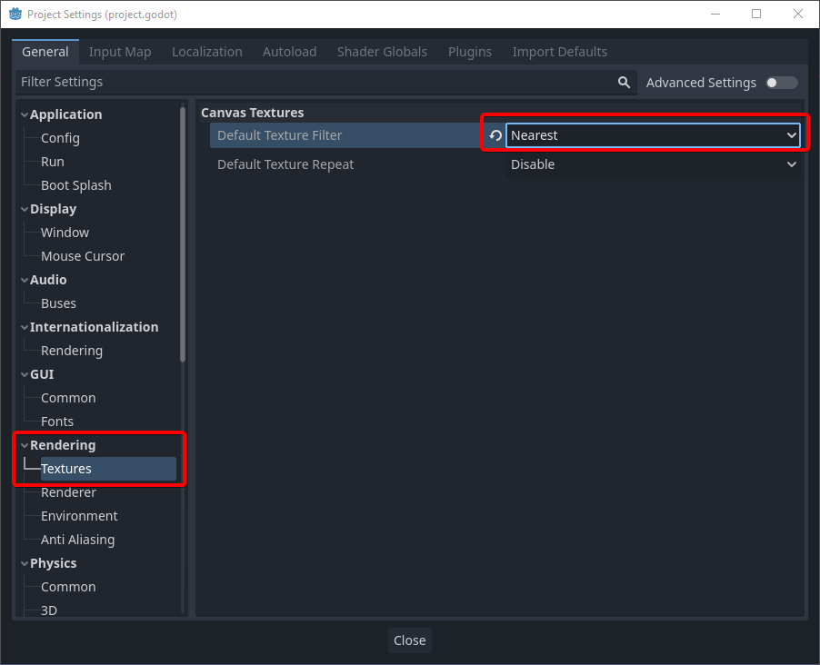
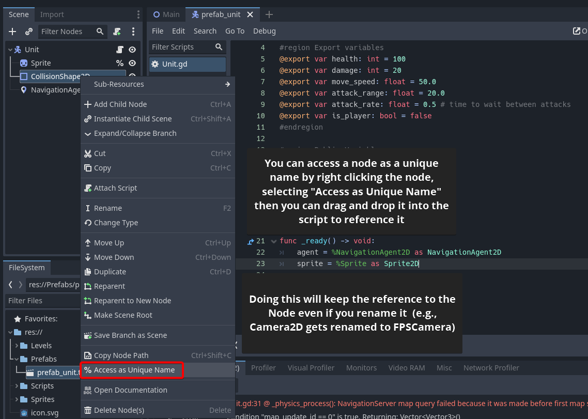

# Learning Docs

I'll try to put together some things I thought would be good to know/come back to in here.

- [Code Order](./code-order.md)

## Images

To fix blurry sprites

How to create a unique name to work with nodes. The best practice is to first try an `@export` variable, then a unique name (see image) (e.g., `%MyNode`), and lastly either a `get_node("NodeName")` call or `$Node` reference variable.

